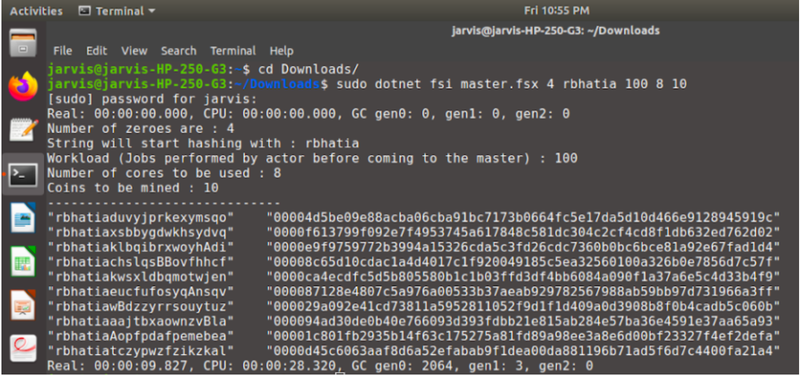

# Bitcoin Miner.

##  Objective
The objective of this project is to use functional programming language and the Akka Actor Model to build a good solution to the Bitcoin Mining problem using a distributed system that runs well on multi-core machines.
## Run

Machine 1 (Server):

`dotnet fsi Master.fsx --number-core --input-string --workload --number-of-cores --number-of-coins`

Machine 2,3,4,5...n (Client):

`dotnet fsi Client.fsx --server-ip-address`
##  Work Force Tested

In the program, the worker receives a request for mining with the number of coins to be mined given as input by the user using the command line. Since the number of cores in the client machine was 4, we used 8 actors to be spawned on a single machine with each actor performing 100 iterations before asking for a new job from the master.

